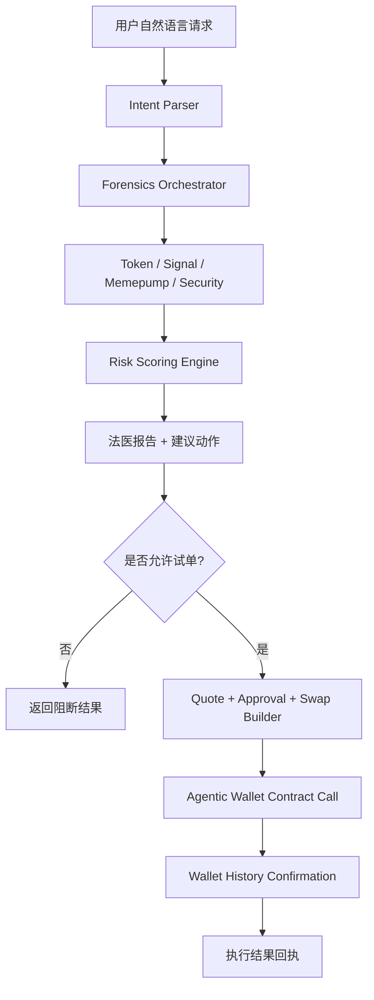

# Meme Forensics Agent

一个面向 X Layer 的自然语言 Meme Token 法医技能。

它不是一个“看到币就直接买”的交易机器人，而是一个先做取证、再做风控、最后才允许小仓位执行的安全代理。用户只需要用自然语言描述意图，Agent 就会自动完成代币情报聚合、开发者背景检查、持仓结构分析、聪明钱动向观察、安全扫描，以及受保护的小仓位试单。

## 项目简介

Meme Forensics Agent 的核心目标，是把 X Layer 上 Meme Token 的研究和交易流程，从“手动切多个工具、自己拼判断”变成“自然语言驱动的链上法医工作流”。

它解决的是两个很常见的问题：

1. Meme Token 信息碎片化，用户需要在 Token 数据、开发者历史、聪明钱、风控结果之间来回切换。
2. 普通交易工具只负责给报价和下单，不负责回答“这个币为什么值得警惕”。

因此，这个项目把能力拆成两个连续阶段：

- `Forensics`：先聚合证据，再输出风险分、红旗项和建议动作
- `Guarded Execution`：只有在没有触发阻断条件时，才允许走小仓位试单

## 核心能力

- 自然语言触发，不要求用户记忆 CLI 子命令
- 聚合 `Token / Signal / Memepump / Security / Wallet / Swap` 多路能力
- 输出完整法医报告：
  - 风险分
  - 红旗项
  - 观察项
  - 建议动作：`avoid / watch / probe`
- 支持受保护的小仓位试单
- 支持真实的 X Layer 执行闭环：
  - 报价
  - ERC-20 授权
  - Agentic Wallet 广播
  - 交易确认轮询

## 架构概述



### 代码分层

- `src/cli.js`
  - 自然语言入口，支持单次调用和交互式调用
- `src/core/intent.js`
  - 负责将用户输入解析为 `analyze / quote / probe`
- `src/core/forensics.js`
  - 负责编排法医分析、报价、授权、执行与确认
- `src/core/scoring.js`
  - 负责把原始链上情报转换为风险分和建议动作
- `src/providers/onchainos.js`
  - 负责封装 OnchainOS CLI 调用
- `src/config.js`
  - 负责 `.env` 加载

## 运作机制

### 1. 自然语言理解

用户可以直接说：

- `帮我查这个币是不是土狗盘`
- `查开发者有没有 rug 历史`
- `聪明钱是在建仓还是出货`
- `如果风险不高，先帮我试 1 USDC`

系统会从输入中提取：

- 链名
- 代币地址或符号
- 意图类型
- 资金代币
- 金额

### 2. 法医分析

系统会并行拉取以下维度的信息：

- 代币基础信息、价格、流动性、持仓集中度
- 开发者历史、同类项目、bundle / same-car 线索
- 聪明钱 / KOL / whale 相关信号
- honeypot / 风险扫描结果

### 3. 风险评分

评分引擎会根据以下因素给出结论：

- 开发者 rug 记录
- Top holder 集中度
- bundle / sniper / suspicious holding
- 流动性是否过低
- 安全扫描是否阻断
- 智能资金是否表现为集中出货

最终输出：

- `avoid`
- `watch`
- `probe`

### 4. 受保护执行

如果用户请求试单，系统不会直接下单，而是走：

1. 获取实时报价
2. 如果是 ERC-20 起始资产，先生成并执行 `approve`
3. 等待授权交易在钱包历史中确认成功
4. 构建真正的 swap calldata
5. 通过 Agentic Wallet 发起 `contract-call`
6. 轮询钱包历史，确认交易 `SUCCESS`
7. 返回最终成交回执

这意味着项目并不把“拿到交易数据”误判成“已经成功上链”。

## OnchainOS Skill / Uniswap Skill 使用情况

当前版本以 **OnchainOS Skills** 作为主要能力底座，未直接依赖官方 Uniswap Skill；但在 OKX DEX Aggregator 路由中，底层流动性路径可能会经过 Uniswap V4 或其他 X Layer DEX。

### 已使用的 OnchainOS 能力

| 能力模块                 | 命令族                                                                                       | 在项目中的作用                             |
| ------------------------ | -------------------------------------------------------------------------------------------- | ------------------------------------------ |
| Token Intelligence       | `token search / info / price-info / advanced-info / holders / liquidity`                     | 代币识别、流动性、集中度、标签与风险元数据 |
| Smart Money Signals      | `signal chains / signal list`                                                                | 观察 smart money / KOL / whale 动向        |
| Meme / Trenches Research | `memepump token-details / token-dev-info / similar-tokens / token-bundle-info / aped-wallet` | 开发者画像、bundle、同车地址、相似项目     |
| Security                 | `security token-scan`                                                                        | honeypot 与基础风险扫描                    |
| Wallet                   | `wallet status / addresses / balance / contract-call / history`                              | 地址获取、余额查询、真实广播、交易确认     |
| DEX                      | `swap quote / approve / swap`                                                                | 报价、授权数据、交易 calldata 构建         |

### Uniswap Skill 使用说明

- 当前版本没有直接调用官方 Uniswap Skill
- 但底层聚合路由可能命中 `Uniswap V4`
- 如果后续扩展成网页端或 LP / 更复杂执行器，可以继续接入官方 Uniswap AI Skills

## 部署地址

### 当前交付形态

- 交付类型：本地运行的 Codex Skill / CLI 项目
- 目标网络：`X Layer`
- Chain ID：`196`
- 主入口：`node src/cli.js`

### 公网部署信息

- GitHub Repository：`https://github.com/apermanent/meme-forensics-agent`
- Demo Video：`https://www.youtube.com/shorts/r_xyWoCls-o`
- Public Demo URL：当前版本暂无公网前端部署地址

### 合约部署说明

本项目当前 **没有自定义链上合约部署**。

原因是它的定位不是新协议，而是一个建立在 X Layer 现有流动性和 OnchainOS 基础设施之上的 **自然语言法医与执行技能**。真实交易由 OnchainOS 路由和 Agentic Wallet 完成，不依赖项目方额外部署 Router 或 Vault 合约。

## 链上能力验证

为了证明这个 Skill 不只是“会分析”，而是真的具备链上执行能力，项目已经在 `X Layer` 上完成了一次完整的小仓位买入和一次完整的卖出回合。

### 验证钱包

- Wallet Address: `0x104e0d79280c493d8a45b01122fcc19b360069ed`
- Chain: `X Layer`

### 回合 1：小仓位买入 XDOG

- Intent: `分析后执行小仓位试单`
- Pair: `USDC -> XDOG`
- Spend: `1 USDC`
- Received: `237.231214358762982336 XDOG`

链上交易：

- Approval tx: `0x8ca06d830b13876e711b9a89c934c9da9fc9a714801f49fa28aec8842878c0d8`
- Swap tx: `0xf1ac6ffe77f70b4106739d5f511cf5304f7041b644eae33739ac2531894ec4be`

### 回合 2：全部卖出 XDOG

- Intent: `全部卖出`
- Pair: `XDOG -> USDC`
- Sold: `237.231214358762982336 XDOG`
- Received: `0.994617 USDC`

链上交易：

- Approval tx: `0x56ed0cbbf9dc7c51558accb322014f1963b59ed7af37b4645a2f6516a0c1775e`
- Swap tx: `0x748c61dae43d8153dda59dcaa1941782205b5d82f817f0a8115d80959bd7b741`

### 这证明了什么

- Skill 可以完成真实的 `quote -> approve -> swap -> confirmation`
- Skill 可以调用 `Agentic Wallet` 发起真实合约调用
- Skill 可以通过 `wallet history` 对交易结果做确认，而不是把“生成交易数据”误判为“已成功上链”
- Skill 已具备 `X Layer` 上的真实执行闭环，而不只是只读研究工具

## 项目在 X Layer 生态中的定位

Meme Forensics Agent 在 X Layer 生态中的定位，不是替代 DEX、钱包或行情工具，而是成为这些能力之间的 **安全意图层**。

它处在这样一个位置：

- 对用户侧：
  - 降低 Meme Token 研究门槛
  - 提供“先判断，再试单”的安全入口
- 对钱包和交易入口：
  - 充当交易前的风险守门员
  - 把自然语言输入转换成结构化执行流程
- 对 X Layer 生态：
  - 提高 Meme 交易的可理解性和可复用性
  - 让“研究 + 风控 + 小额执行”形成更完整的 Agent Workflow

一句话概括：

> 它是 X Layer 上一个面向 Meme Token 场景的安全优先交易技能，而不是单纯的换币工具。

## 团队成员

- `[永恒-apermanent@outlook.com]` - Solo Builder

## 本地运行

### 环境要求

- Node.js
- 已安装 `onchainos`
- 已登录 `Agentic Wallet`
- 工作目录下存在 `.env`

### `.env` 需要的变量

先复制模板文件：

```bash
cp .env.example .env
```

然后填写：

```bash
OKX_API_KEY=...
OKX_SECRET_KEY=...
OKX_PASSPHRASE=...
```

### 安装与启动

```bash
npm install
npm start
```

或直接执行单次自然语言请求：

```bash
node src/cli.js "帮我查这个币是不是土狗盘 <token address> xlayer"
node src/cli.js "分析后给出小仓位试单报价 <token address> xlayer"
node src/cli.js "分析后执行小仓位试单 <token address> xlayer"
```

## 示例请求

- `帮我分析这个币能不能买：<token address> xlayer`
- `查这个币开发者有没有 rug 历史：<token address> xlayer`
- `查 bundle / sniper / 同车地址：<token address> xlayer`
- `查聪明钱 / KOL / whale 动向：<token address> xlayer`
- `分析后给出小仓位试单报价：<token address> xlayer`
- `分析后执行小仓位试单：<token address> xlayer`

## 当前状态

- 已完成自然语言法医分析
- 已完成 X Layer 小仓位试单闭环
- 已验证：
  - 法医报告生成
  - 钱包状态 / 地址识别
  - 报价流程
  - ERC-20 授权
  - Agentic Wallet 广播
  - 钱包历史确认
  - 链上真实买入与卖出回合

## 备注

- 在 Codex sandbox 内，Node 的子进程调用会受限，所以完整链上验证需要在沙箱外执行
- 当前版本更偏向 Skill / Agent 交付，而不是公开网页应用
